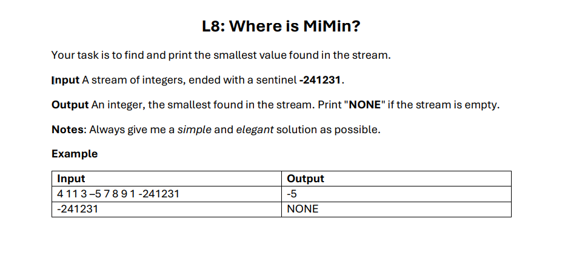

# Question Example



Answer in DAP language:
```javascript
program WhereIsMimin
dictionary
    n, palingKecil : integer
algorithm
    read n
    palingKecil <- n

    while n != -241231 do
        if palingKecil > n then
            palingKecil <- n
        endif

        read n
    endwhile

    if palingKecil == -241231 then
        write "NONE"
    else
        write palingKecil
    endif
endprogram
```