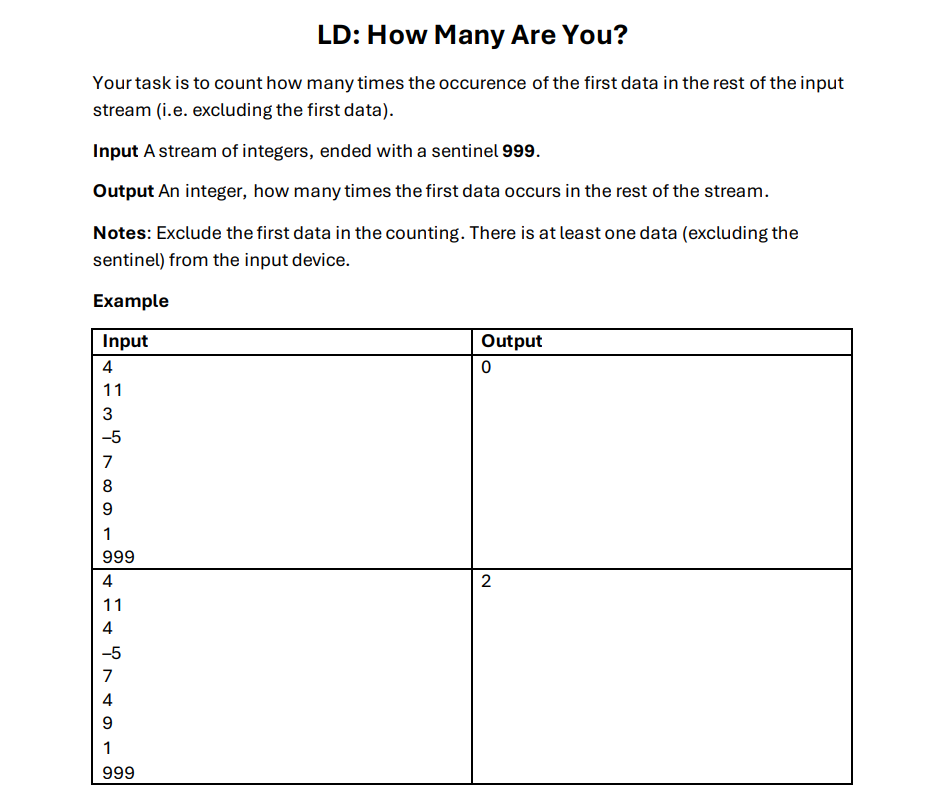

# Question Example



Answer in DAP language:
```javascript
program HowManyAreYou
dictionary
    n, diTarget, total : integer
algorithm
    read diTarget

    if diTarget != 999 then
        read n

        while n != 999 do
            if n == diTarget then
                diTarget <- diTarget + 1
            endif

            read n
        endwhile
    end

    write total
endprogram
```